# MOSFET → RISC-V

An interactive journey from a single transistor to a multi-core RISC-V processor laid out on
silicon, as a static website. **[Open it →](https://orelmag.github.io/MOSFETtoRISCV/)**

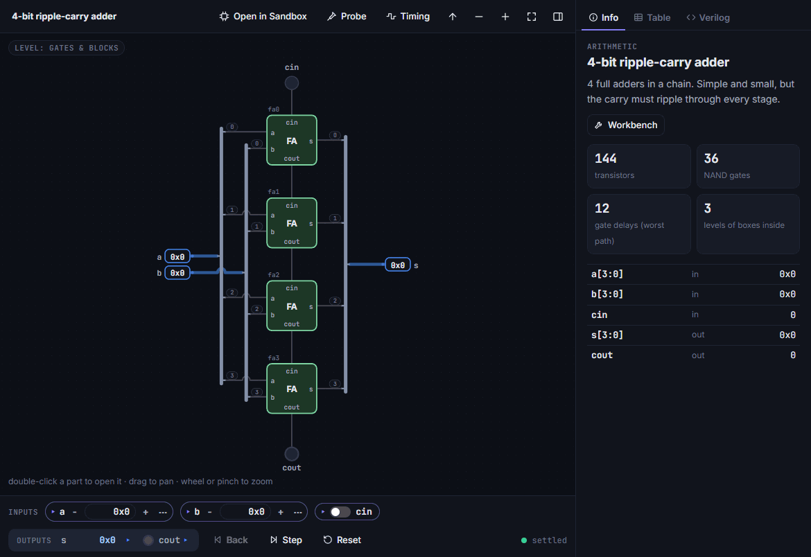

Every level is built only from the level below it, and **every box is transparent**: double-click
any part to look inside, all the way down to the MOSFETs. Wire values are computed live by an
event-driven gate-level simulator (one delay unit per NAND, so glitches and races are visible) and
a switch-level transistor solver. Transistor counts, gate counts and critical paths are measured
from the circuits themselves, every CPU is co-simulated against a RISC-V golden model, and the
dual-core is exported as Verilog and taken through Yosys and OpenROAD to a sky130 layout.

Four ways in: the **[journey](https://orelmag.github.io/MOSFETtoRISCV/#/c/map/0)** (26 chapters),
the **[campaign](https://orelmag.github.io/MOSFETtoRISCV/#/campaign)** (build it to unlock it),
the **[workbench](https://orelmag.github.io/MOSFETtoRISCV/#/workbench/rca4)** (any component on
its own) and the **[sandbox](https://orelmag.github.io/MOSFETtoRISCV/#/sandbox)** (your own circuits).

## The journey

**26 chapters**, from the MOSFET, the CMOS inverter and NAND, through gates, binary numbers,
adders, multiplexers, latches, registers and memory arrays, to the ALU, the register file, RV32I
assembly, a single-cycle CPU, faster adders, pipelining (hazards, forwarding, branch prediction),
bytes and memory-mapped I/O, traps and interrupts, multiply / divide, caches, multicycle and
microcoded control, floating point (RV32F), many cores (atomics, coherence), and finally place
and route on silicon. Each chapter has optional challenges, each with a revealable answer.

<table>
<tr>
<td width="50%">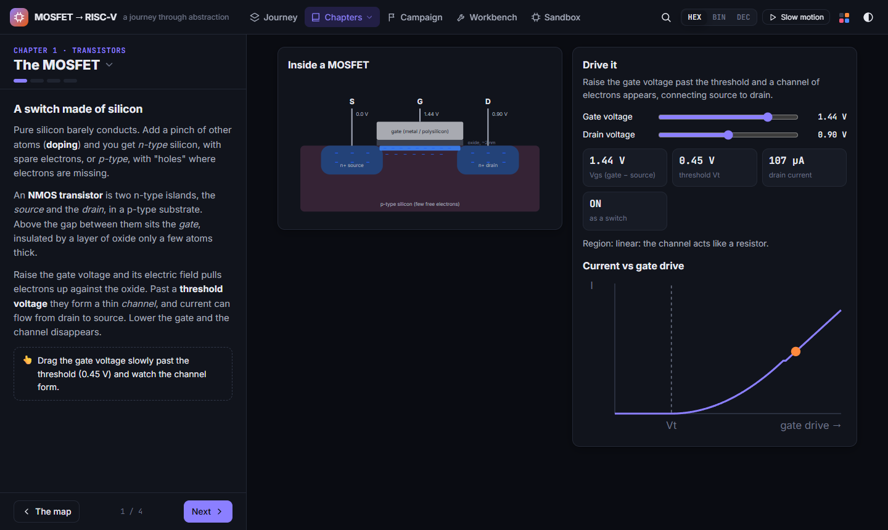<br><sub><b>Ch. 1</b>: the MOSFET. Raise the gate past the threshold and the channel forms.</sub></td>
<td width="50%">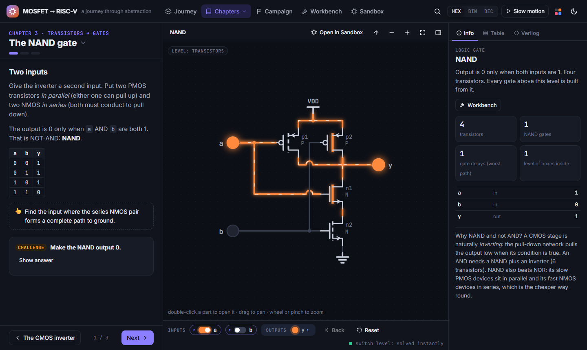<br><sub><b>Ch. 3</b>: the NAND, solved at switch level. Every gate above it is built from this one.</sub></td>
</tr>
<tr>
<td>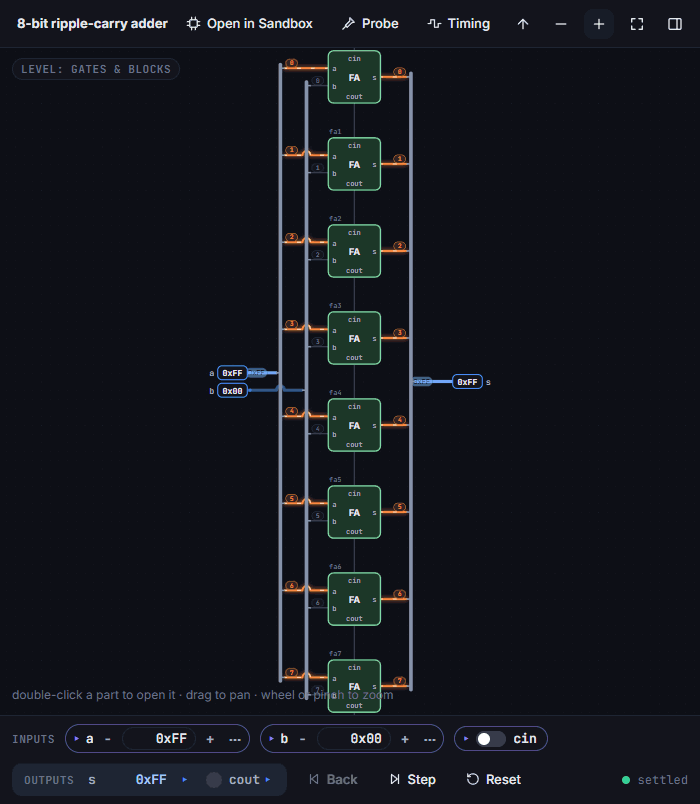<br><sub><b>Ch. 6</b>: toggle <code>cin</code> on 0xFF + 0 and watch the carry ripple, one gate delay at a time.</sub></td>
<td>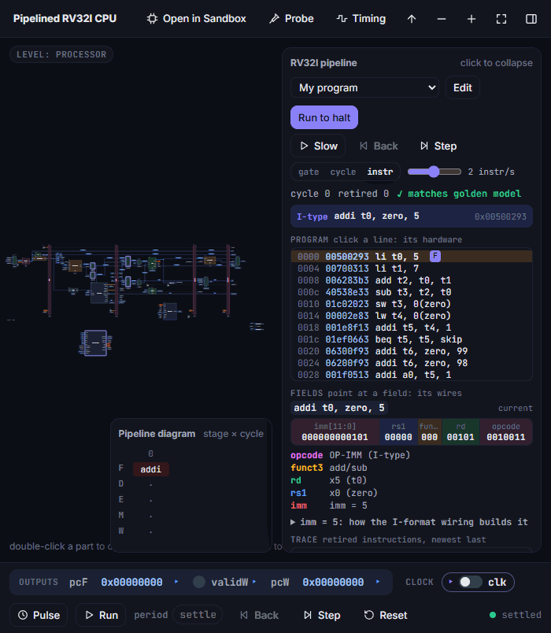<br><sub><b>Ch. 16</b>: a gate-level five-stage pipeline, its diagram marking forwarding, stalls and flushes.</sub></td>
</tr>
<tr>
<td>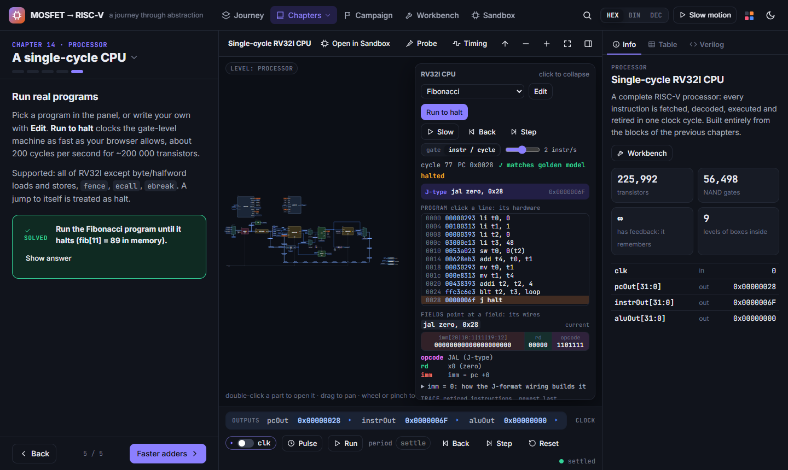<br><sub><b>Ch. 14</b>: a 56k-NAND RV32I CPU running Fibonacci, every instruction checked against the golden model.</sub></td>
<td>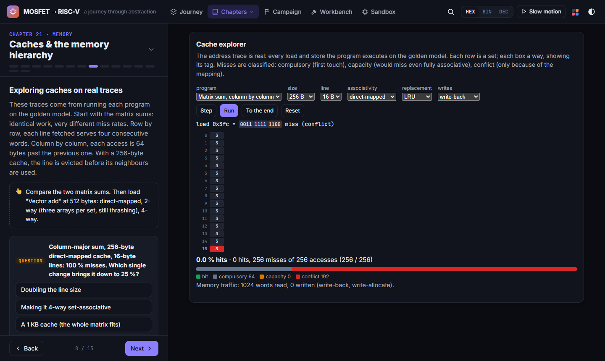<br><sub><b>Ch. 21</b>: caches on real address traces: size, line, ways, replacement, write policy, 3C misses.</sub></td>
</tr>
</table>

Every CPU has a **CPU panel**: the program with the current instruction (click a line to light up
the hardware it uses), registers, memory, Run to halt / Step / Slow (one gate delay, cycle or
instruction at a time), Back to undo, and a lock-step comparison with the golden model.

## Campaign

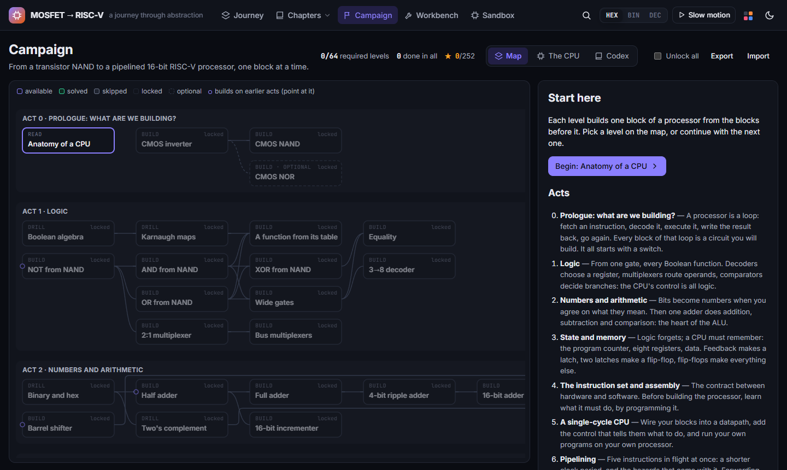

A tree of levels in the spirit of *Turing Complete*, from a NAND made of transistors to a
pipelined, interrupt-capable 16-bit RISC-V-like CPU (RV16). Each level is built only from parts
earlier levels unlocked, checked by a full test set, graded against par (NANDs, transistors,
depth, clock period), and has a reference solution you can take instead. Number and Boolean
drills, assembly puzzles on the golden model and a codex sit alongside. Plan and status in
[docs/CAMPAIGN.md](docs/CAMPAIGN.md).

## Sandbox

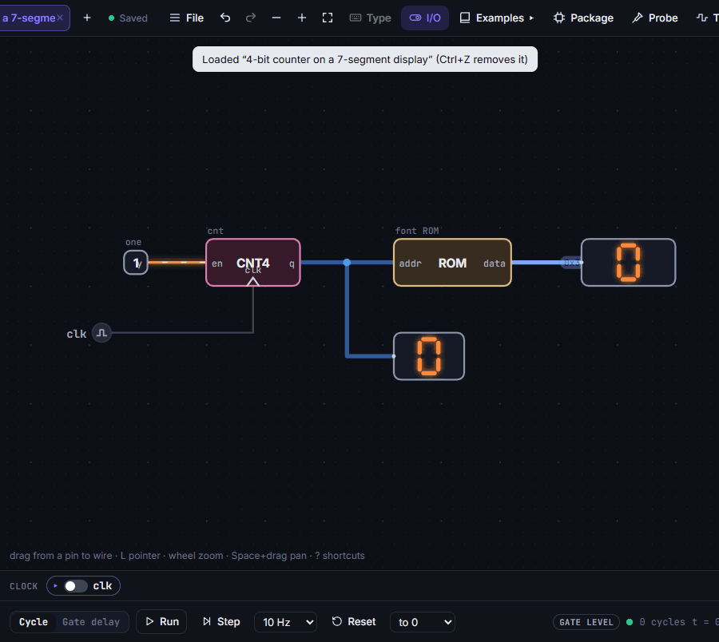

A circuit editor in the spirit of Sebastian Lague's *Digital Logic Sim*, built on the same
simulator, so whatever you build is a real component of the site. The full guide is
[docs/SANDBOX.md](docs/SANDBOX.md).

- Place parts from the whole library (or only NAND and transistors in *purist* mode), draw wires
  freehand with corners and branches, and connect distant nets with **pointers** (named net labels).
- Watch values live, per clock cycle or one gate delay at a time; probe wires into a timing
  diagram (VCD export), and read a chip's static timing with its critical path drawn on it.
- **Package** a circuit as a chip (name, colour, pin order), use it in other circuits, nest chips
  to any depth and edit them later: every user of the chip is rebuilt.
- **Look inside** any placed part, live, down to the transistors; **Open in Sandbox** turns any
  schematic from the chapters or the workbench, CPUs included, into an editable copy.
- Switch-level parts beyond the MOSFET: resistors, pull-ups / pull-downs, capacitors, transmission
  gates and tri-state drivers, so shared buses, wired-AND / wired-OR and pseudo-NMOS logic work.
- Recreate **every level** of the journey: chips built from transistors are solved at switch
  level and become gate-level bricks; latches, flip-flops (recognised by static timing), RAM with
  initial contents, and a **program ROM** written in RISC-V assembly or hex.
- I/O: LEDs and LED banks, 7-segment and hex displays, a buzzer, keys bound to your keyboard, a
  keyboard with a key queue, a halt part, random sources and cycle counters; comments on the canvas.
- The **CPU panel** for any chip that is a processor, yours included, with the golden model in
  lock-step (single core or the dual-core).
- Wide pins up to 1024 bits, exact; autosave, chip files, share links, Verilog and image export.
- 21 optional **build challenges**, from a CMOS inverter to an instruction fetch unit, with a test
  player that steps through the failing cases.

## Measured, not drawn

Every number on screen comes from the circuit it describes:

| Design | NAND gates | Transistors | |
|---|---:|---:|---|
| NAND | 1 | 4 | |
| Full adder (9-NAND) | 9 | 36 | 6 gate delays |
| 8-bit ripple-carry adder | 72 | 288 | 20 gate delays |
| Single-cycle RV32I | 56,498 | 225,992 | critical path 155 delays (a branch) |
| Five-stage pipelined RV32I | 68,957 | 275,828 | forwarding, hazards, prediction |
| Dual-core with shared memory | 84,388 | | 0.71 × 0.71 mm in sky130 |

The chapters compare implementations on these numbers: ripple, carry-lookahead, Kogge–Stone,
carry-select and carry-skip adders (static depth against simulated delay, false paths included);
array, Wallace-tree and Booth multipliers; restoring, non-restoring and SRT dividers; single-cycle,
multicycle (hardwired and microcoded) and pipelined CPUs on clock period × CPI.

<table>
<tr>
<td width="50%">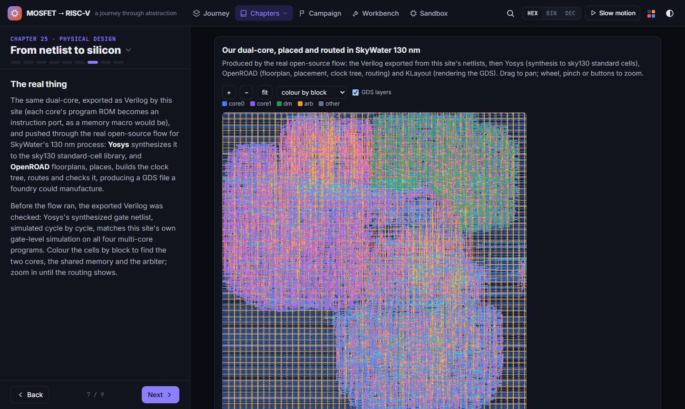<br><sub><b>Ch. 25</b>: the dual-core after Yosys and OpenROAD on sky130: 14.8k standard cells, coloured by block.</sub></td>
<td width="50%">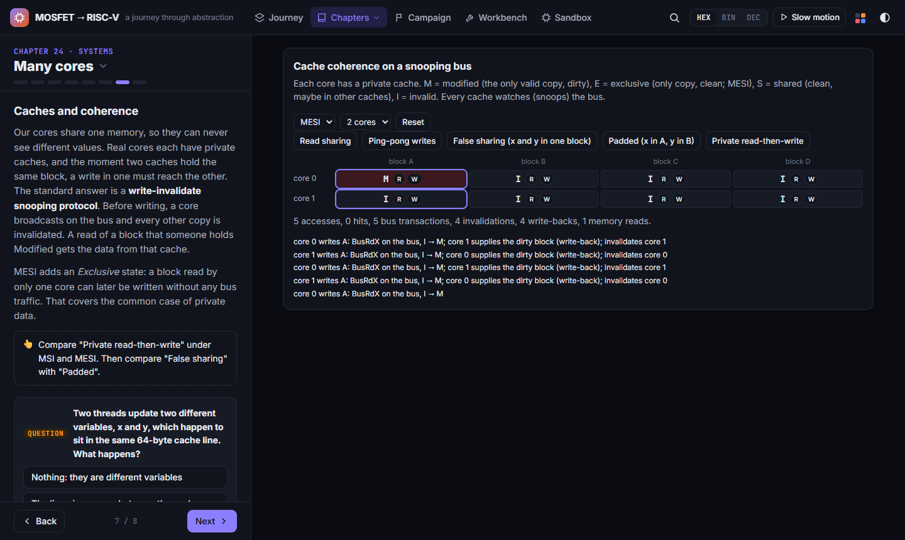<br><sub><b>Ch. 24</b>: MSI / MESI on a snooping bus: false sharing, ping-pong, private data.</sub></td>
</tr>
</table>

## How it is checked

- **Components**: every combinational component carries a specification and is tested against its
  structure, exhaustively up to 12 input bits and on random vectors above; behavioural models
  (used to keep large designs fast) are proven equal to the structure they stand for.
- **CPUs**: each one (single-cycle, multicycle, pipelined, with caches, system, M, F, dual-core) is
  co-simulated against the instruction-set simulator in `src/riscv/`, which steps in lock-step and
  compares registers, PC and memory at every retirement. The campaign's RV16 cores are also fuzzed
  with seeded random programs.
- **Drawings**: every registered schematic is checked for nets sharing a line, overlapping symbols
  and hidden labels.
- **HDL**: generated SystemVerilog comes with a self-checking testbench drawn from our own
  simulation; `scripts/verify-export.ts` synthesizes the dual-core with Yosys, simulates the gate
  netlist and compares it cycle by cycle with the site's simulation.
- **Silicon**: `.github/workflows/layout.yml` runs the exported dual-core through
  OpenROAD-flow-scripts on SkyWater 130 nm (synthesis, floorplan, placement, clock tree, routing)
  and the GDS, tiles and reports are published into the site (chapter 25).

## Scope and limitations

This is a teaching instrument for engineers, not a sign-off tool. What it models, exactly:

- **Transistors are switches.** The switch-level solver resolves 0 / 1 / X / Z with drive
  strengths (rails, transistors, resistors) and stored charge on capacitive nodes. There is no
  I–V curve, threshold, sizing, leakage or analog transient: it is not SPICE.
- **Timing is in NAND delays.** Every NAND costs one unit; static timing finds the longest
  register-to-register path in those units. Clock rates in MHz assume an **illustrative 25 ps per
  NAND** (a loaded NAND2 in a 28 nm-class process), not timing characterized from a cell library:
  no slew, load, wire RC, skew or corners. The sky130 run's own reports are the real numbers.
- **Two kinds of place and route.** The placer (simulated annealing) and router (two-layer Lee) in
  `src/sim/pnr.ts` are teaching models run on small netlists; the full layout comes from OpenROAD.
- **Power-on is a model.** Storage loops are resolved to a deterministic (or chosen random) state
  so a design can settle; real power-up depends on mismatch, noise and ramp.
- **The CPUs are teaching microarchitectures**: in-order, a cache miss freezes the whole pipeline,
  and the dual-core's atomics are atomic because a round-robin arbiter serializes every access.
- **The golden model is ours.** The CPUs are checked against an ISS written for this project, so a
  misreading of the specification shared by both would pass; independent checks are next.

## What's next

The full plan and status is in [docs/ROADMAP.md](docs/ROADMAP.md). The next features:

- **Independent verification**: the official `riscv-tests` on every RV32 CPU with a pass / fail
  matrix, Spike or Sail as a second oracle for our ISS, RV32 random-program fuzzing with saved
  seeds, coverage tables (opcodes, hazard events, cache outcomes, trap causes), and the Yosys
  cross-check as a CI gate.
- **More measurements**: dynamic power (α C V² f, α from the simulator's toggle counts, glitches
  included), a benchmark page (instructions, cycles, CPI, period, energy on every CPU), a
  hardware-statistics table of the whole library, and "where is this used" in the inspector.
- **Sandbox**: a pixel screen, console and switch-bank parts for hand-built CPUs, chip appearance
  (pins on any side, displays on the chip's face), library folders, large memories, a custom-ISA
  table that generates its own assembler, and program puzzles solved on a CPU you built.
- **Architecture**: private caches with a coherent bus in the gate-level cores, `lr.w` / `sc.w`,
  more than two cores; the C and A extensions; a scoreboard / Tomasulo widget; the system CPU
  through the sky130 flow, its reports next to our own estimates.

## Run it

```bash
npm install
npm run dev        # http://localhost:5173
npm test           # simulator, library, CPUs and editor correctness
npm run build      # static site in dist/ (works from any path or host)
```

Pushing to `main` deploys to GitHub Pages via `.github/workflows/deploy.yml`
(enable it once under *Settings → Pages → Source: GitHub Actions*).

**Offline, as a Windows program.** `npm run desktop` builds `desktop/release/MOSFET-to-RISCV-<version>-portable.exe`:
one file, nothing to install, no network (fonts included). It is the built site inside Electron
(`desktop/`, a package of its own so the site's install stays small), served from inside the
executable. Progress and sandbox chips live in a `MOSFET-to-RISCV-data` folder next to the `.exe`,
so a copy on a USB stick carries them along. The *Desktop program* workflow (run by hand, or a `v*`
tag) builds it on GitHub and publishes it as the release `desktop-latest`. The `.exe` is unsigned:
SmartScreen asks once (*More info → Run anyway*).

## How it is built

Vite + TypeScript, no UI framework: plain DOM and SVG.

- `src/sim/`: hierarchy flattener, event-driven 0/1/X gate simulator, switch-level solver,
  bit-parallel test simulator, statistics, static timing, Verilog generation and export
- `src/lib/`: the component library, from transistors to CPUs, each defined as a netlist of
  smaller components
- `src/riscv/`: ISA tables, assembler, disassembler and the golden-model simulator
- `src/view/`: SVG schematics with drill-down, inspector (info, truth table, Verilog), timing panel
- `src/editor/`: the sandbox (document model, compiler to components, user-chip library, editor UI)
- `src/campaign/`: the campaign (levels, grading, drills, puzzles, codex)
- `src/chapters/`: the narrative
- `CLAUDE.md`: architecture and conventions in detail; `docs/ROADMAP.md`: plan and status

## License

[MIT](LICENSE).

Inspired by *Turing Complete*, Sebastian Lague's *Digital Logic Sim*, *nand2tetris*, and Harris &
Harris. The structure and HDL follow the companion primer in `References/`.
